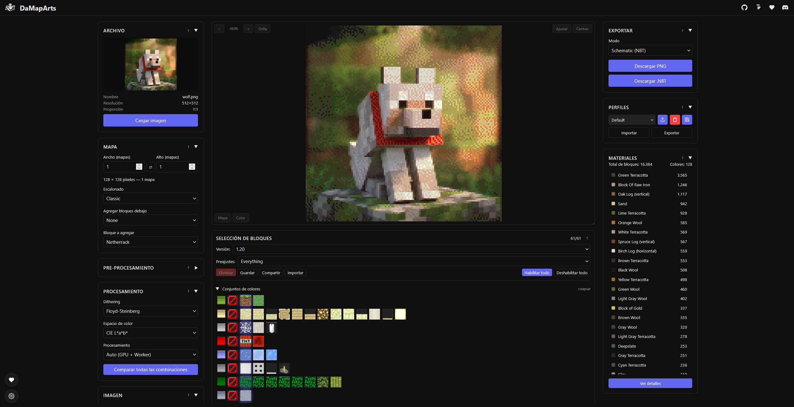

# DaMapArts



DaMapArts is a web application for converting images into **Minecraft map art**.
It lets you upload an image, tune processing settings, quantize it to Minecraft block palettes with dithering, and export practical build outputs.

## Live URLs

- Primary: https://damaparts.iroak.cl/
- Mirror: https://iiroak.github.io/DaMapArts

## Features

- Image upload (`JPG`, `PNG`, `WebP`, `GIF`)
- Map-based cropping and scaling (`128x128` per map)
- Image adjustments (brightness, contrast, saturation)
- Optional pre-processing (bilateral filter + edge detection)
- Palette quantization to Minecraft blocks
- Multiple dithering algorithms
- Live preview, material counts, and export panel

## Tech Stack

- SvelteKit + Vite
- TypeScript
- Tailwind CSS
- Vitest

## Requirements

- Node.js 20+
- pnpm 9+

## Installation

```bash
pnpm install
```

## Development

```bash
pnpm dev
```

Open the local URL shown by Vite (usually `http://localhost:5173`).

## Available Scripts

```bash
pnpm dev          # start development server
pnpm build        # production build
pnpm preview      # preview production build locally
pnpm check        # type-check + svelte-check
pnpm check:watch  # watch mode for checks
```

## GitHub Pages (Project Page)

This repository is configured for GitHub Pages deployment via GitHub Actions.

- Workflow file: `.github/workflows/deploy.yml`
- Output directory: `build`
- Expected URL type: `https://<username>.github.io/<repository>` (or root when using custom domain)
- `BASE_PATH` is read from GitHub Repository Variable `BASE_PATH`

In GitHub repository settings, set:

1. **Pages → Build and deployment → Source** = `GitHub Actions`
2. Keep default branch as `main`

Base path configuration:

- For custom domain (root), keep `BASE_PATH` empty
- For project subpath, set `BASE_PATH` to `/<repository>`

## Project Structure

```text
src/
	routes/                # app layout and main page
	lib/
		components/          # main UI (upload, preview, export, materials, etc.)
		processor/           # image processing pipeline
		palette/             # palette and color-space logic
		dither/              # dithering algorithms
		stores/              # global app state
		export/              # export utilities
static/
	images/                # static images and assets
references/              # reference projects/material (not core app runtime)
PIPELINE.md              # full technical processing pipeline documentation
```

## Processing Pipeline

See `PIPELINE.md` for full details. High-level flow:

1. Image upload and validation
2. Crop/scale to target map resolution
3. Color adjustments
4. Optional pre-processing (bilateral + edge mask)
5. Palette quantization
6. Dithering
7. Material counting
8. Export

## Acknowledgements

This project is based on prior work from the MapartCraft ecosystem, especially:

- [rebane2001/mapartcraft](https://github.com/rebane2001/mapartcraft)
- [mike2b2t/mapartcraft](https://github.com/mike2b2t/mapartcraft)

Additional community credits (Map Artist of 2b2t):

- **jkascpkmc**
- **WASM**
- **THCFree**

for memo-technique lineage and related mapart workflow contributions.

Thanks to the original authors and contributors, especially **Mike (mike2b2t/mapartcraft)**, for **foundational ideas**, **data formats**, **tooling**, and **the latest technique updates and improvements** adopted in this project.

Additional acknowledgement for advanced NBT/water workflow discussion and reference context:

- [EvModder/PNG-to-NBT](https://github.com/EvModder/PNG-to-NBT) by **Év / Fletch**
- Credits explicitly noted in that context: **Év / Fletch**, **mike**, **Gu2tv4**
- Reference license for that project/context: **CC BY-NC-SA 4.0**

Note: DaMapArts keeps its own project license below. Any direct reuse of third-party code/content should follow the original attribution and license terms of that source.

## License

This project uses the same license as the referenced previous project: **GNU General Public License v3.0 (GPL-3.0)**.
See the `LICENSE` file for the full text.

## Status

Active development.
